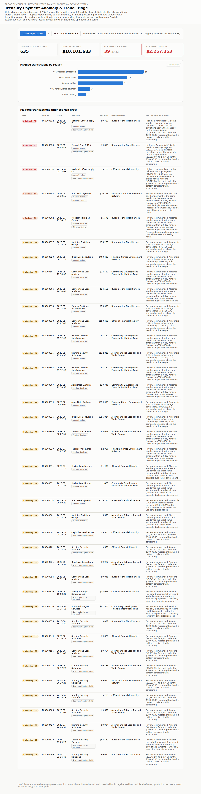

# Treasury Payment Anomaly & Fraud Triage — Proof of Concept

A lightweight, client-side prototype that ingests vendor payment / disbursement
records and statistically flags transactions worth a closer look — with a
plain-English explanation of *why* each one was flagged — for an analyst to
triage.

**Live demo:** [kgeise1.github.io/treasury-payment-anomaly-poc](https://kgeise1.github.io/treasury-payment-anomaly-poc/)

**Brief documentation of approach, tools used, and assumptions made:** see [`APPROACH.md`](APPROACH.md).



## Problem framing

Treasury processes an enormous volume of vendor payments and disbursements.
Improper payments — duplicates, fraud, processing errors — are a well-known,
material risk across federal payment operations. A human reviewer cannot
manually eyeball every transaction, but most anomalies leave statistical
fingerprints: unusual amounts for that vendor, near-simultaneous duplicate
payments, activity outside normal processing hours, brand-new vendors
suddenly receiving large sums, or amounts sitting suspiciously just under a
reporting threshold. This POC demonstrates a fast, transparent, explainable
first pass that surfaces those patterns for a human to review — it is not a
replacement for existing controls, just a triage aid.

## What it does

1. Load a CSV of transactions (the bundled synthetic sample, or your own file
   with a compatible header row — see below).
2. Every transaction is scored 0–100 by a set of statistical rules run
   entirely in your browser (see **Approach** below).
3. Transactions crossing the risk threshold (default: 35) are shown in a
   sorted table with a severity badge, the specific reason code(s) that
   triggered, and a generated narrative explanation.
4. A summary panel shows totals, flagged count/amount, and a breakdown of
   which anomaly types are driving the most flags.
5. Each flagged row has an illustrative reviewer disposition control
   (Pending / Confirmed / False Positive / Escalated, plus a reviewer name
   and notes) and an **Export review log (CSV)** button — a sketch of the
   segregation-of-duties workflow a production version would need, not a
   real access-control system (nothing is saved server-side; see
   `COMPLIANCE.md`).

## Quick start (run locally)

No build step, no install required to run the app itself — it's plain
HTML/CSS/JS. You do need to serve it over HTTP (not open the file directly)
so the browser is allowed to `fetch()` the bundled sample CSV:

```bash
python3 -m http.server 8000
# then open http://localhost:8000/index.html
```

or, equivalently: `npm start` (same command, defined in `package.json`).

Click **Load sample dataset**, or **Upload your own CSV**.

### CSV format expected

| column | required | notes |
|---|---|---|
| `transaction_id` | yes | any unique string |
| `date` | yes | `YYYY-MM-DD` |
| `time` | no | `HH:MM`, 24-hour; defaults to noon if omitted (timing checks are skipped/weakened without it) |
| `vendor_id` | yes | used to group a vendor's payment history |
| `vendor_name` | no | display only |
| `department` | no | display only |
| `payment_type` | no | display only |
| `amount` | yes | numeric, `$`/commas are stripped automatically |
| `description` | no | display only |

## Approach / methodology

Detection logic lives in `src/detection.js` and is intentionally rule-based
and transparent rather than a black-box model — for a Treasury audience, an
examiner needs to see *why* something was flagged, not just a score. Five
signals, each worth points toward the 0–100 composite risk score:

- **Amount outlier** (+40) — the payment's z-score against that vendor's own
  historical mean/standard deviation exceeds 3, with a ratio-based fallback
  for vendors with too few payments for a stable standard deviation.
- **Possible duplicate payment** (+40) — same vendor, same amount to the
  cent, within a 3-day window of another payment.
- **New vendor, large first payment** (+35) — a vendor with ≤2 payments on
  record whose payment is in the top 10% of all payment amounts.
- **Near reporting threshold** (+35) — amount between $9,500–$9,999.99, a
  pattern consistent with structuring just under a common $10,000 reporting
  line.
- **Off-hours timing** (+15, corroborating only) — processed on a weekend or
  before 06:00 / after 21:00. Kept low-weight and non-triggering alone
  because plenty of legitimate batch ACH runs happen overnight.

A transaction is flagged once its combined score reaches **35**. Amounts
outside a $0.01–$100,000,000 sanity range are excluded from analysis
entirely (not clamped) rather than allowed to distort a vendor's own
baseline statistics — see `SECURITY.md`'s note on statistical poisoning.
Explanations
in `src/narrative.js` are template strings driven by the same reason codes
and their computed detail (z-score, vendor average, matching transaction ID,
etc.) — no LLM call, no external API, no key required, so the deployed app
has zero secrets and zero external runtime dependencies.

### Sample data

`data/sample_transactions.csv` is synthetic, generated by
`scripts/generate_sample_data.py`. It plants ~35 deliberate anomalies (of the
five types above) inside ~600 baseline "normal" recurring-vendor payments so
the detector has something realistic to catch. Regenerate or resize it with:

```bash
python3 scripts/generate_sample_data.py --rows 600 --seed 42 --out data/sample_transactions.csv
```

## Tools used

- Vanilla HTML/CSS/JavaScript — no framework, no build step, no CDN
  dependency (a dependency-free CSV parser and a hand-rolled SVG bar chart
  are included in `src/`) so the deployed prototype works offline and behind
  restrictive network policies once loaded.
- Python 3 (standard library only) for the synthetic sample-data generator.
- Playwright (Node), used only for the automated smoke test in
  `tests/e2e_smoke_test.js` — not a runtime dependency of the app.

## Assumptions & known limitations (POC scope)

- **Synthetic data.** No real Treasury data was used or is required; the
  bundled CSV is fabricated for demonstration.
- **Thresholds are illustrative**, not calibrated against real historical
  payment distributions. A production rollout would need those weights and
  the $10,000 threshold tuned against real data and stakeholder input, and
  ideally validated/back-tested against known confirmed-fraud cases.
- **No persistence, auth, or real audit trail.** Everything is recomputed
  client-side on each load; nothing is saved, logged, or sent anywhere. The
  reviewer disposition workflow (see above) shows the *shape* of case
  tracking, but it's session-only and unauthenticated. A production version
  would need real role-based access and a persisted, tamper-evident audit
  log — see `COMPLIANCE.md`.
- **No PII/sensitive-data handling controls** beyond "nothing leaves the
  browser" — a production version touching real payment data would need to
  run under whatever hosting/compliance environment Treasury requires (e.g.
  FedRAMP-authorized infrastructure), not a static demo host.
- **Rule-based, not ML.** This deliberately favors an explainable, auditable
  first pass over a black-box model. A natural next step is comparing this
  baseline against a trained anomaly-detection model once enough
  labeled/confirmed cases exist to validate one.

## Project structure

```
.
├── index.html                  Dashboard shell
├── styles.css                  Styling (design tokens documented inline)
├── src/
│   ├── app.js                  UI wiring, disposition workflow, CSV export
│   ├── detection.js            Anomaly scoring engine
│   ├── narrative.js            Rule-based explanation generator
│   ├── chart.js                Dependency-free SVG bar chart
│   └── csv.js                  Dependency-free CSV parser
├── data/sample_transactions.csv
├── scripts/generate_sample_data.py
├── tests/
│   ├── e2e_smoke_test.js       Playwright smoke test
│   ├── security_test.js        Adversarial test (XSS, prototype pollution, etc.)
│   └── audit_trail_test.js     Adversarial test (CSV formula-injection export)
├── SECURITY.md                 Security review
├── COMPLIANCE.md               Risk & compliance review
└── package.json
```

## Deployment

Because the app is fully static (no backend, no secrets), it's deployed via
GitHub Pages directly from this repository. To redeploy after changes: push
to `main`, then in **Settings → Pages** set the source to the `main` branch,
root folder (already configured for this repo). The live URL follows the
pattern `https://<github-username>.github.io/<repo-name>/`.

## Testing

```bash
npm install              # installs Playwright for the smoke test only
python3 -m http.server 8000 &
npm test                  # loads the page, runs the sample dataset, checks the
                           # results render with no console errors
npm run test:security     # feeds the app a hostile CSV (XSS payload, a
                           # __proto__ header, an out-of-range amount, a
                           # missing required field) and asserts every one
                           # is neutralized -- see SECURITY.md
npm run test:audit-trail  # records a disposition with a spreadsheet-
                           # formula-injection payload in the notes field,
                           # exports the CSV, and asserts the payload was
                           # neutralized in the actual downloaded file
```

See [`SECURITY.md`](SECURITY.md) for the security review of this prototype:
what was found and fixed, what's deliberately out of scope for a static
demo, and why SQL injection specifically doesn't apply to this
architecture. See [`COMPLIANCE.md`](COMPLIANCE.md) for the risk &
compliance review — relevant federal frameworks (OMB A-123, OMB M-25-21 AI
governance, the GAO Green Book), the segregation-of-duties reviewer
disposition workflow added to the UI, and the governance gaps that are
correctly out of scope for a static demo but would need closing before any
real deployment.
